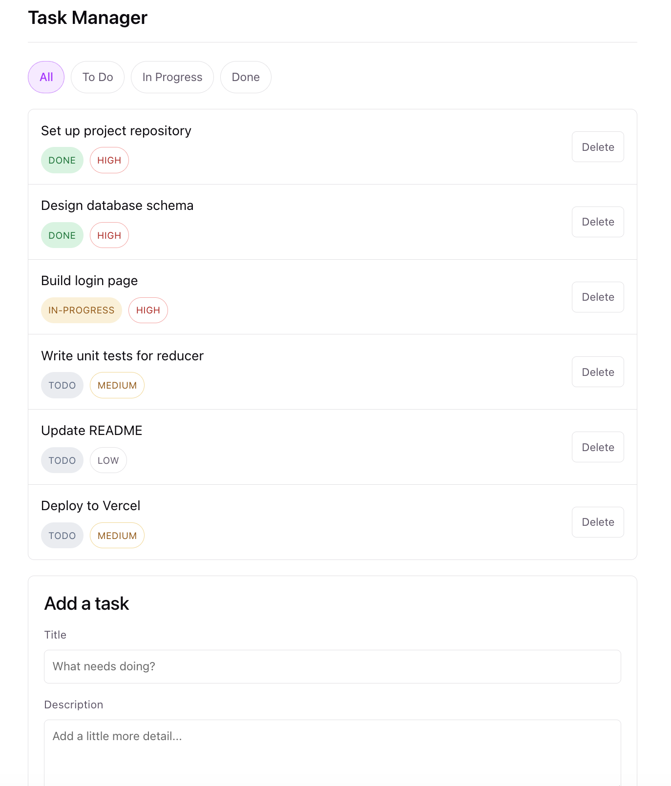

# Task Manager — learning `useReducer`, `useContext`, and React Router

A small task-manager app built to demonstrate three core React concepts.
The code is deliberately flat and heavily commented so it can be read
top-to-bottom as a learning resource.

## Run it

```bash
npm install
npm run dev
```

Then open the URL Vite prints (usually http://localhost:5173).


